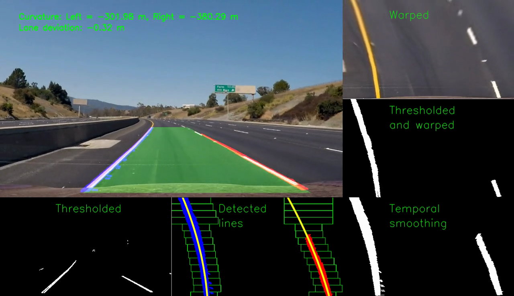
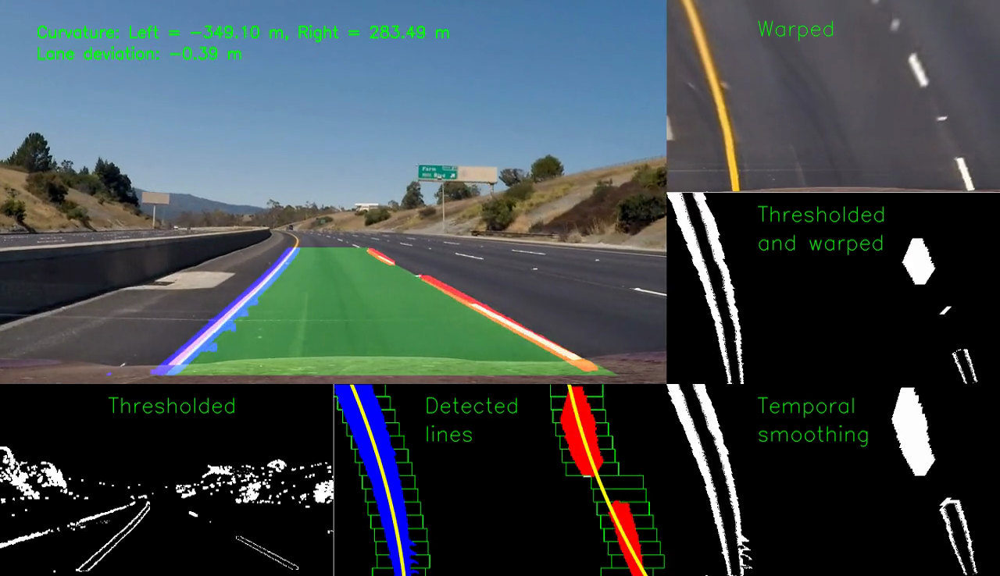
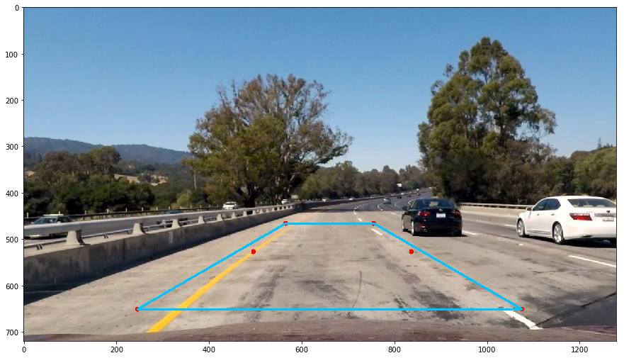
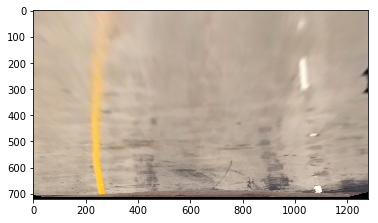
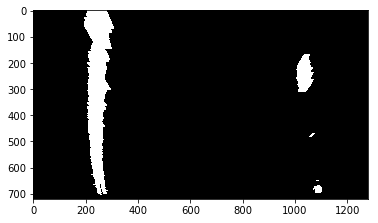
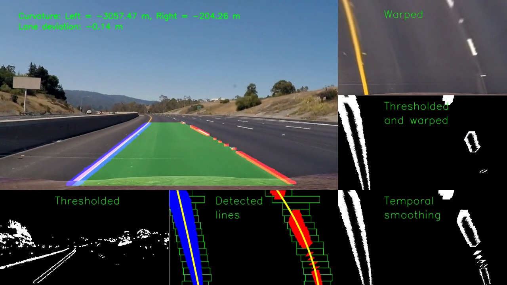
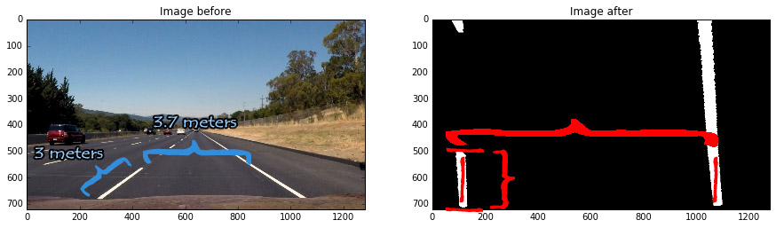

## Advanced Lane Finding Project


The goals / steps of this project are the following:

* Compute the camera calibration matrix and distortion coefficients given a set of chessboard images.
* Apply a distortion correction to raw images.
* Use color transforms, gradients, etc., to create a thresholded binary image.
* Apply a perspective transform to rectify binary image ("birds-eye view").
* Detect lane pixels and fit to find the lane boundary.
* Determine the curvature of the lane and vehicle position with respect to center.
* Warp the detected lane boundaries back onto the original image.
* Output visual display of the lane boundaries and numerical estimation of lane curvature and vehicle position.


## [Rubric](https://review.udacity.com/#!/rubrics/571/view) Points
### Here I will consider the rubric points individually and describe how I addressed each point in my implementation.  

---
### Writeup / README

####1. Provide a Writeup / README that includes all the rubric points and how you addressed each one.  You can submit your writeup as markdown or pdf.  [Here](https://github.com/udacity/CarND-Advanced-Lane-Lines/blob/master/writeup_template.md) is a template writeup for this project you can use as a guide and a starting point.  

You're reading it!
###Camera Calibration

#### 1. Briefly state how you computed the camera matrix and distortion coefficients. Provide an example of a distortion corrected calibration image.

This part was accomplished in the `Camera calibration.ipynb` notebook,

The beginning task was to create `objp `, a matrix that contains the chessboard corners (aka the point where 2 black squares and 2 white squares connect) in the world space. Assuming `objp` is the same for each image, we need to compute `corners` which is a matrix that contains the corners' coordinates in the image space. After that, there was need to call `cv2.calibrateCamera()` to compute a mapping between `objp` and `corners`.

When I had prepare both set of points, it was just a matter of calling `cv2.undistort()` to get the resultant undistorted image that can be seen below:


### Pipeline (single images)

#### 1. Provide an example of a distortion-corrected image.
<a name="Provide-an-example-of-a-distortion-corrected-image"/></a>
After calibrating the camera, a test needed to be done. Hence, I tried with one of the test images: 

Original: `test1.jpg`


When compared with the resultant image below, seems at first sight that there isn't much change... but have a look to the white car. This is the biggest sign that the distortion correction is happening: the white car is wider and gets cropped.

At the begining I tested it with `test2.jpg` but was very difficult to appreciate changes. This one was a better example.

Distortion-free: `test1_undistorted.jpg`


#### 2. Describe how (and identify where in your code) you used color transforms, gradients or other methods to create a thresholded binary image.  Provide an example of a binary image result.

This part was accomplished in `Pipeline_part1.ipynb`

The idea was using a mix of color thresholds and gradient thresholds in order to properly segmet lane's lines.

After a quick visualization of the HLS-converted image, it was clear that the S channel was the most suitable for this task. However, the first idea that came into my mind was to extract patches from the lines (a yellow one and a white one) and plot some histograms of all channels to help me to create lower and upper thresholds for binarizing. While this approach was a great idea... it was not good enough, so I proceed to use `ipywidgets.interact` to create some sliders that allowed me to better select those thresholds. Here was more important to have a good recall over having a good precision, as false positives can be rejected out when doing gradient analysis.

After finding properly color thresholds, was time to went with gradient thresholding. Again `ipywidgets.interact` was key to success. A combination of gradient's magnitude and gradient's angle was used to extract lane's lines.

After these two process, I was wondering how to combine the results, and I got the following idea: 


> combining both thresholded images by summing or by logical or doesn't make much > sense. I'm looking for white and yellow lines, not something yellowish like > grass an random lines like traffic signs. But... gradient images present a lot of > noise, lane lines are not continuous (have some holes). What about something > like:
> 
> final_ threshold = color_threshold & dilation(gradient_threshold)"

And this was the result:


_UPDATED RESULT_
----------------

After some tests, it was discovered that combining color_ threshold and gradient_ threshold using logical AND was very good in precission, but very poor in recall, hence, a less restrictive approach using logical OR was used. This, of course, comes at expenses of the precission, however, algorithms in later steps are able to deal with the extra noise.
The difference can be seen in these 2 images in the Thresholded window:

Using logical AND


Using logical OR



#### 3. Describe how (and identify where in your code) you performed a perspective transform and provide an example of a transformed image.

I performed the perspective transform in `Pipeline_part1.ipynb`. A test image was opened in an image editor to measure X and Y coordinates that I found were relevant for the transformation. After that, I plotted them in the image and drew a polygon on top (see image below), to check everything was working as expected.


Then the transformation was done following the next steps:

```python
undistorted_yellow = undistort(laboratory_rat, camera_calibration)
birds_eye = perspective(combined, M)
```

and I got this:


If a `threshold` call is placed between `undistort` and `perspective`, this is the result achieved:


It was necesary to do the threshold before the perspective transformation because the gradients' direction threshold was tuned before perspective. Otherwise we will have a worse segmentation.


_UPDATED RESULT_
----------------

The chosen points were modified besides the offsets for destiny points to increase a bit the surface in the ROI in order to include more portion of lane lines. 

Another subtle trick was added: this modification was intended also to slightly change the aspect ratio of the lanes, making them longer than wider. This way, curve fitting step is less error prone and avoids fitting a curve with a too low curvature radius.





#### 4. Describe how (and identify where in your code) you identified lane-line pixels and fit their positions with a polynomial?

This part is achieved in `Pipeline_part2.ipynb`. I follow the approach presented in the classroom. At the begining, selecting the half of the image to do the histogram didn't convenced me enough, I thought it was too big portion of the image, in case of a heavy curve, it will introduce some error. However, experimentally I saw it was a good idea, specially when dashed lines appeared at top of the image (meaning that no line was detected at the bottom).

The result produced by `detect_lanes` can be inspected calling `visualize_detected_lines`, and these are the detected lines in two test images:

Test1: 


Test2:


Test2 image's visualization is very important as it shows that even with a carefully tuned pipeline, the algorithm can work in unexpected ways. Despite the fact that the right line was straight, the information contained in the image after thresholding and a perspective transformation, leaded the detection algorithm to fit a order 2 polynomial too curved.


_UPDATED RESULT_
----------------

The `detect_lanes` function includes 3 new interesting changes:

1. The size of the windows is no longer static but dynamic. After fitting each window, if not enough line's pixel were found, next window will have a bigger size (width) in an attempt to find the lines. This was motivated because when the curvature is big, the algorithm wasn't unable to adapt fast enough to those changes.
2. There are now more windows with a smaller height, because of the same reason, to give a fast response in case the lines are too curvy.
3. A temporal smooth technique was added: at the beginning of the algorithm, a buffer that includes previous thresholded bird's eye views is blended with the current image, this way, we address the issue when not enough portion of line lays inside of the ROI.

These changes can be appreciated in the Detected lines' window and in Temporal smoothing's window


#### 5. Describe how (and identify where in your code) you calculated the radius of curvature of the lane and the position of the vehicle with respect to center.

In `Pipeline_part2.ipynb` a `get_curvature` function is used to compute the curvature of the left and right lines limiting the lane. The mathematical operations were done based on the polynomials fitted in the previous step. However, the result was .. what? The curvature was measured in pixels, which means nothing in the world space. A mapping pixel <-> meters was done using known object's sizes that appeared in the image. To be more exact: the width of the lane and the length of the dashed lines. 



After obtaining that conversion in the bird-eye view of the lane, `get_curvature_in_meters` was created.

To compute the deviation from the center it was measured the center between the lane's lines and the center of the image and compared. After some test, the conversion factor to meters was added (where was my head?). These operations were packed in `get_deviation_from_center`.


#### 6. Provide an example image of your result plotted back down onto the road such that the lane area is identified clearly.

Instead of a "simple" image with the result, I prefer to link here the ouput images from the function `control_panel` created in `Pipeline_part2.ipynb`. It shows the final result with the result plotted back on the road, but also the result of different stages in the processing pipeline (extremely useful for debugging).


_UPDATED RESULT_
----------------

Some changes were done in the visualization to add more information:


---

### Pipeline (video)

#### 1. Provide a link to your final video output.  Your pipeline should perform reasonably well on the entire project video (wobbly lines are ok but no catastrophic failures that would cause the car to drive off the road!).

Here's a [link to my video result](https://youtu.be/aHXLlSVbrLI)


<a href="http://www.youtube.com/watch?feature=player_embedded&v=aHXLlSVbrLI
" target="_blank"></a>


_UPDATED RESULT_
----------------

Here's a [link to my new video result](https://youtu.be/mPOVgYOt8PY)


<a href="http://www.youtube.com/watch?feature=player_embedded&v=mPOVgYOt8PY
" target="_blank"></a>

---

### Discussion

#### 1. Briefly discuss any problems / issues you faced in your implementation of this project.  Where will your pipeline likely fail?  What could you do to make it more robust?

This version of the Lane Lines finding is far more robust than the first one accomplished at the begining of this nanodegree. However, there is still room to improve.

In `project_video.mp4`, despite some minor wobbly lines that can be fixed in the future with more time, the algorithm used worked OK. However `harder_challenge.mp4` video gave me the key of how to brake the pipeline (first step to make it more robust): there are lightning issues such as images too saturated and random sparks where white balances must be applied. Other problems found were: reflections in the car's windshield, other vehicles crossing the lane's lines, hard curves where the proposed ROI (Region Of Interest) does not match the lane.. Some steps to deal with these problems could be: vehicle detection and tracking and an adaptative ROI depending on the curvature of the lane measured with the default ROI.

_UPDATED RESULT_
----------------

The biggest issue I found in the previous submission was those frames where only a small portion of the dashed lines appeared in the ROI. Without enough detected line, specially at the top and at the bottom of the image, the line detection algorithm tended to fit too curvy lines producing wobbliness. Now with the temporal smoothing technique, this issue was successfully addressed.
